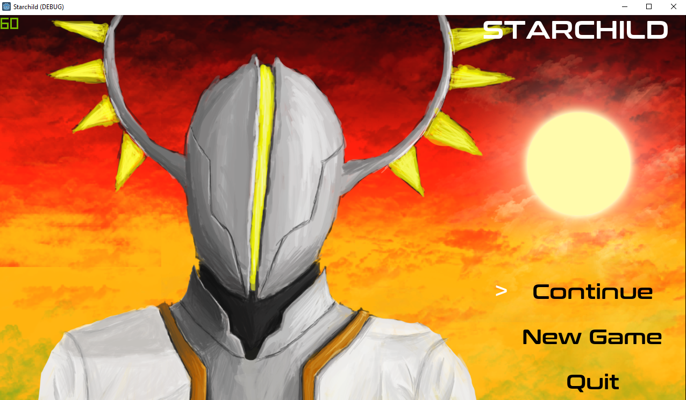
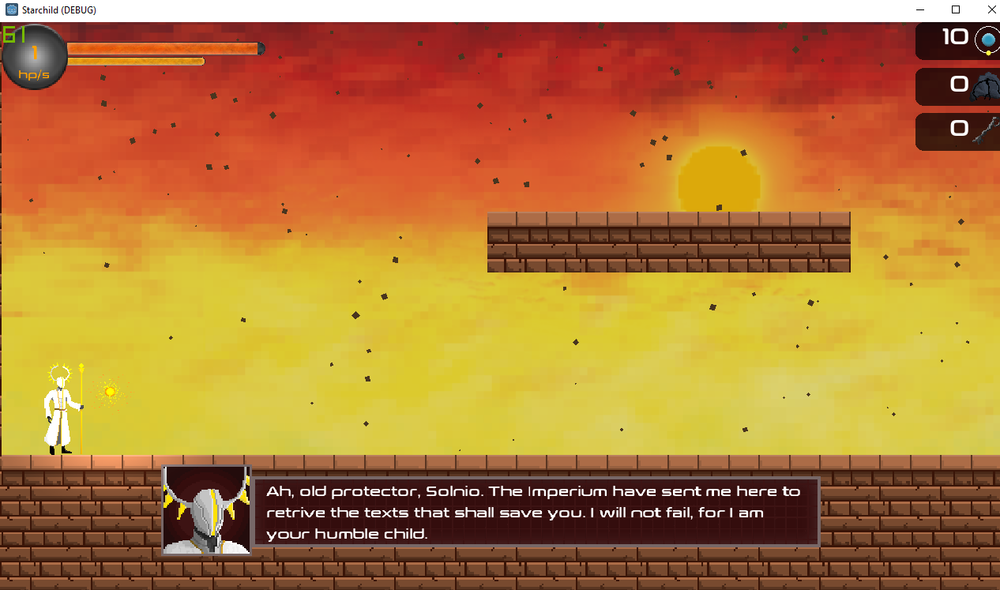
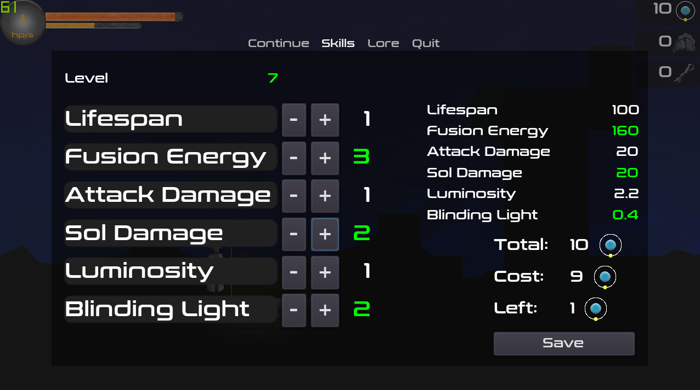

Authors: SHARJEEL ALI

## Overview

Starchild is a game developed for a class project in COMP-4501 at Carleton University. The game itself is a 2D platformer story focused game developed in Godot where the player must traverse through three different dimensions to reach the ending of the story. Throughout the player's journey, they will encounter many forms of enemies, each unique to their dimension, and must either defeat or evade them to survive using their unique, upgradable abilities.

This game will take you about 20 - 30 min to complete on average.

# Table of Contents
1. [Story](#story)
2. [Controls](#controls)
3. [Screenshots and Gameplay](#screenshots-and-gameplay)
4. [Structure](#structure)
5. [Sources](#sources)

## Story

Starchild is a game that takes place far, far in the future, in a time when humankind is governed by an order known as the *Imperium*. For many generations, the Imperium have worshipped the *Living Stars*, and thus bask in their power. However, slowly, one by one, the stars have faded, dying. Yet no one knows why. That is, until the player, the *Priest of Solnio* has been sent to prevent the death of the last Living Star, *Solnio*, and uncover the truth behind this heat death.

## Controls

[A] - move left

[D] - move right

[SPACE] - jump (hold for greater height)

[SHIFT] - dodge

[CTRL] - Activate/decative sol form

[ESC] - Pause menu

[E] - Use doors

[R] - Heal (Requires hydrogen orbs)

[Q] - Teleport between Void and Reality (Need to have unknown secretions)

[LEFT-MOUSE] - attack

[RIGHT-MOUSE] - use blinding light (Must unlock first)

[SCROLL-WHEEL] - Increase/decrease life rate

## Screenshots and Gameplay

Gameplay

Main Menu

Dialogue

Leveling

## Structure

Node Connections

Code structure

## Sources

Every art asset in the game was created by me, unless the source was listed below:

### Sprites
Sprite particles: https://opengameart.org/content/smoke-particle-assets
https://lpc.opengameart.org/comment/59828

Enemy sprites (And base template for the player sprite): https://opengameart.org/content/platformer-animations: Clint Bellanger

### Fonts

https://www.dafont.com/conthrax.font

### Music
https://opengameart.org/content/mystical-piano
https://opengameart.org/content/subtrist
https://opengameart.org/content/reversing-time-stuck-in-time
https://opengameart.org/content/time-slow
https://opengameart.org/content/heartbeat-single-sound
https://opengameart.org/content/3-melee-sounds
https://opengameart.org/content/metal-impact-sounds: Brain MacIntosh
